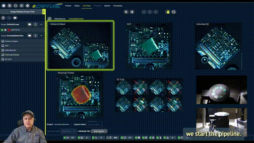

I built a high-speed industrial anomaly detection demo to show [Emergent Vision's](https://emergentvisiontec.com/) software capabilities at the 2025 [inVISION Days](https://openwebinarworld.com/en/events/invision-days/) digital conference.

In this fun example, a high-speed [EROS 10 GigE](https://emergentvisiontec.com/products/eros-he-10gige-cameras-rdma-area-scan/) camera captures images of PCBs moving rapidly on a rotary stage. Each image is processed by an unsupervised anomaly detection neural network to determine whether it is "normal" or "anomalous", i.e. has a defect, such as a scratch or a foreign object. If a PCB is identified as "anomalous", an LED immediately illuminates it with a red X. All this happens in a fraction of a second!

You can watch the webinar, presented by Emergent Vision's president John Ilett, [here](https://www.linkedin.com/posts/emergent-vision-technologies-inc-_invision-days-ai-inspection-using-high-speed-activity-7401626745612996608-rHuW) or [here](https://openwebinarworld.com/en/videothek/18863/).