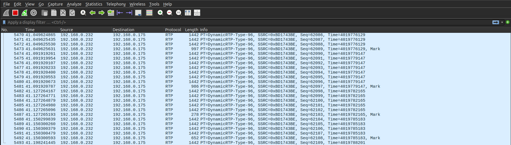

## What is Mobstr

When I was working on a [ball-tracking project](https://issledova.tel/posts/interceptor/) from home, there were a few times when I wanted to test a real-time detection algorithm, but didn't have access to the cameras in the lab. I had to record a ball with my phone, email the video to myself, and download it to the computer. Then I would realize the lighting is too dark and would have to redo it. It was clunky and frustrating, and I remember thinking to myself, "Why can't I just connect to my phone camera directly?" This is how I got the idea for Mobstr.

Mobstr, short for Mobile Stream, is an application that streams a smartphone's camera feed to a PC on the local network. Its purpose is to make camera hardware more accessible for computer vision developers by eliminating the need for dedicated devices. You can find the source code on [GitHub](https://github.com/polinamials/Mobstr).

Mobstr can be a useful alternative for students, hobbyists, and tinkerers, since there aren't many good budget machine vision cameras. Cheap USB webcams are low-resolution and have limited settings, and the more-or-less decent Raspberry Pi Camera can only be used with the Raspberry Pi. Yet, almsot everybody now has an HD smartphone camera in their pocket, so why not use it instead?

I'm really excited to start this project because it's something I myself will use and something other might find useful too. I'm going to document its development in this article series to push myself to actually finish it, because it would be pretty embarrassing to hype it up in Part 1, then abandon it and never write a Part 2.

In this first installment, I will talk about the simple proof-of-concept application I wrote and the improvements it needs. 

## Requirements

Here is a list of technical requirements I came up with for this project. It will likely expand over time, but it's a good start:

- Low latency.
- Easy integration into common image processing pipelines.
- Camera settings (exposure, gain, etc.) can be adjusted manually, either from the app, or remotely from the PC.

To address the first two requirements, I decided to transmit the stream with the [Real-time Transport Protocol (RTP)](https://en.wikipedia.org/wiki/Real-time_Transport_Protocol). It's a widely used network protocol for low-latency video and audio transmission, which can be received by common stream handling software such as FFmpeg, and GStreamer.

The stream should be in a compressed format, such as H.264, also to reduce latency. I would like to eventually support uncompressed streaming, but I'm not yet sure if it's feasible over wireless networks.

As for the last requirement, besides exposing camera settings in the app's UI, I'm also going to implement web API to set the same parameters remotely. 

Mobstr is also going to be an Android app for now, simply because I have an Android phone.

Based on the requirements, this was my checklist for a basic proof-of-concept application:

1. Simple Android frontend.
2. Backend loop that captures compressed camera frames.
3. RTP packetizer to package the frames.
4. Socket to transmit the RTP packets.

## Baby's First Android App

I must admit -- I have never developed for Android before. After spending an hour trying to figure out how to use Android Studio, I added precisely one button to the empty project template. 


*My really basic app.*

With the minimalistic frontend finished, it was time to move on to the backend. Android has a C++ native development kit (NDK), so I wrote all the backend code in C++.

## Encoding and Packetization

RTP is a family of protocols which follow a similar structure, but carry payloads with different media formats. I compress the stream into H.264 with the built-in hardware encoder and transmit it using a lightweight RTP packetizer following [RFC 6184](https://www.rfc-editor.org/info/rfc6184/) -- the RTP payload format for H.264 video.

### H.264

The hardware encoder is simple to setup and start:

```cpp
#include <media/NdkMediaFormat.h>

m_encoder = AMediaCodec_createEncoderByType("video/avc");

AMediaFormat* format = AMediaFormat_new();
AMediaFormat_setString(format, AMEDIAFORMAT_KEY_MIME, "video/avc");
// ... Set more format parameters here

media_status_t status = AMediaCodec_configure(m_encoder, format, nullptr, nullptr, AMEDIACODEC_CONFIGURE_FLAG_ENCODE);
AMediaFormat_delete(format);

ANativeWindow* inputSurface = nullptr;
status = AMediaCodec_createInputSurface(m_encoder, &inputSurface);

AMediaCodec_start(m_encoder);

```

I initialized the encoder with a [Native Window](https://developer.android.com/ndk/reference/group/a-native-window) (equivalent to the Java Surface object) which is essentially a GPU buffer. When the camera captures a raw frame, it copies it to this buffer for the encoder to compress.

The H.264 data consists of [Network Abastraction Layer (NAL) units](https://membrane.stream/learn/h264/3). These are chunks of different types of data, identified by small headers. For example, there are 

- Instantaneous Decoding Refresh (IDR) picture: a keyframe (I-frame), i.e. an encoded full frame.
- Non-IDR picture: encoded frame that only stores the difference from the previous I-frame.
- Sequence Parameter Set (SPS): metadata for one or more coded video sequences.
- Picture Parameter Set (PPS): metadata for one or more coded pictures.

This is how I receive the data from the encoder:

```cpp
ssize_t outBufferIdx = AMediaCodec_dequeueOutputBuffer(m_encoder, &bufferInfo, 10000);

size_t outBufferSize = 0;
uint8_t* compressedData = AMediaCodec_getOutputBuffer(m_encoder, outBufferIdx, &outBufferSize);

uint8_t* naluPayload = compressedData + bufferInfo.offset;

```

Once I've got the data, I need to send it to the RTP packetizer to be processed into network packets.

```cpp
auto rtpTimestamp = static_cast<uint32_t>(bufferInfo.presentationTimeUs * 90 / 1000); // RFC 6184 specifies a 90kHz clock
std::vector<RtpPacket> packets = m_packetizer->processFrame(naluPayload, bufferInfo.size, bufferInfo.flags, rtpTimestamp);

```

### RTP

To implement my own RTP packetizer, I referenced an existing C++ RTP library [uvgRTP](https://github.com/ultravideo/uvgRTP/tree/master) which supported H.264 video transmission. I didn't use uvgRTP directly, becaues it would have been overkill for my simple app.

At a high level, the RFC 6184 specifies three types of RTP packets:

- Single NAL unit packet: holds one whole NAL unit.
- Aggregated packet: contains two or more NAL units.
- Fragmented packet: a NAL unit is split into a series of smaller packets.

Essentialy, we need to check if a NAL is larger or smaller than the network's maximum transmission unit (MTU) to decide which type of RTP packet to convert it into. A typical MTU is 1500, so I set my maximum packet size to 1400 to be safe. 

Once we know which type of RTP packet to use, it's just a matter of generating the right headers to put in front of the payload. For example, here's how I'm generating the main RTP 12-byte header:

```cpp
std::array<uint8_t, 12> RtpPacketizer::getRtpHeader(uint32_t timestamp, bool padding)
{
    std::array<uint8_t, 12> header;

    header[0] = 0x80;
    if (padding) {
        header[0] |= 0x20;
    }

    header[1] = 96;

    header[2] = static_cast<uint8_t>((m_sequenceNumber >> 8) & 0xFF);
    header[3] = static_cast<uint8_t>(m_sequenceNumber & 0xFF);

    m_sequenceNumber++;

    header[4] = static_cast<uint8_t>((timestamp >> 24) & 0xFF);
    header[5] = static_cast<uint8_t>((timestamp >> 16) & 0xFF);
    header[6] = static_cast<uint8_t>((timestamp >> 8) & 0xFF);
    header[7] = static_cast<uint8_t>(timestamp & 0xFF);

    header[8] = static_cast<uint8_t>((m_ssrc >> 24) & 0xFF);
    header[9] = static_cast<uint8_t>((m_ssrc >> 16) & 0xFF);
    header[10] = static_cast<uint8_t>((m_ssrc >> 8) & 0xFF);
    header[11] = static_cast<uint8_t>(m_ssrc & 0xFF);

    return header;
}
```

The initial sequence number and synchronization source identifier are randomly generated at the start of an RTP stream. 

## Putting it All Together

The last thing I did was write a thin wrapper for the standard POSIX socket to send the RTP packets. I started streaming to my PC's port 5004 and monitored the packets in Wireshark. The packets were coming in fast and looked correct.


*Wireshark log of the RTP stream.*

It was time to actually receive and view the stream. I created an session description protocol file `stream.sdp` which describes my stream 

```txt
c=IN IP4 192.168.0.175
m=video 5004 RTP/AVP 96 
a=rtpmap:96 H264/90000
```

and began receiving the stream with FFmpeg using this command:

```bash
ffplay -protocol_whitelist file,udp,rtp -fflags nobuffer -flags low_delay -framedrop -i ./stream.sdp
```

And it worked!



I noticed about 500 ms of latency between the camera and the computer, as well as some dropped packets. I'm not sure if the issue is with sender or the receiver, so this is something I will need to investigate.

## Next Steps

While it's great to see a simple proof-of-concept application working, there a few issues I still need to improve:

- Latency: find where the stream latency is coming from.
- Stability: minimize the number of dropped packets.
- Configurability: un-hardcode parameters such as computer IP and port.
- Add RTP Control Protocol (RTCP): a companion protocol to RTP which monitors transmission quality.

But this is work for another time.

Stay tuned for Part 2!