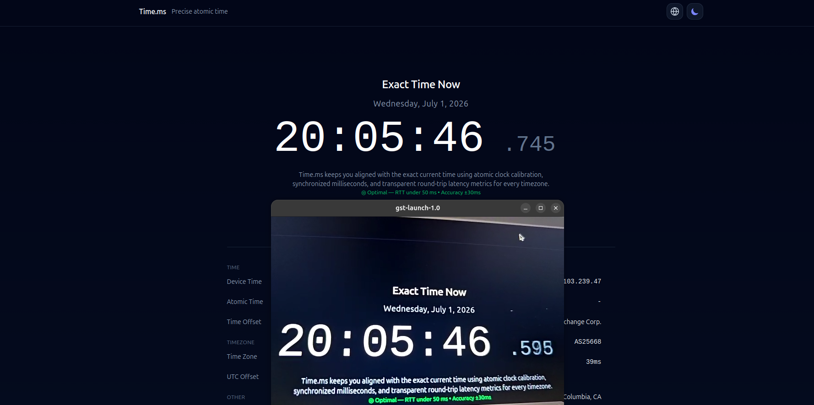
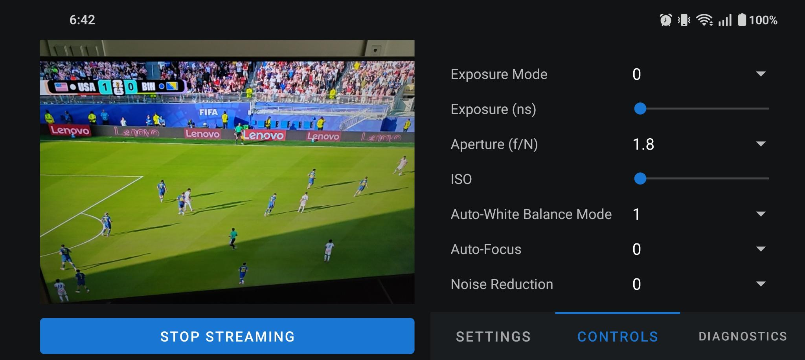



It's a been a while since I first introduced Mobstr in [Part 1](https://issledova.tel/posts/mobstr_part1/) of the Mobstr Logbook. I was distracted by the heat wave and the World Cup, and wasted a whole lot of time debugging a latency issue which ended up being unrelated to the app. 

As I mentioned in Part 1, I was receiving my stream with this FFmpeg command and was observing around \(500\) ms of latency. 

```bash
ffplay -protocol_whitelist file,udp,rtp -fflags nobuffer -flags low_delay -framedrop -i ./stream.sdp
```

I thought the problem must be related to the H.264 encoder or the RTP packetizer, so I spent several days timing every part of the application to measure its end-to-end latency. It sent me down many fruitless rabbit holes, such as trying to change the size of the encoder's input buffer size. 

<!-- ```cpp

AMediaCodecBufferInfo info; 
int outputIdx = AMediaCodec_dequeueOutputBuffer(codec, &info, 0);

if (outputIdx >= 0) 
{ 
    int64_t outputPts = info.presentationTimeUs;
    int64_t targetTime = get_current_time_microseconds();
    int64_t hardwareLatencyMs = (targetTime - outputPts) / 1000;

    __android_log_print(ANDROID_LOG_INFO, "MobstrPerf", "Hardware Encoder Latency: %lld ms", hardwareLatencyMs);

}
``` -->

When timing `AMediaCodec_dequeueOutputBuffer`, my logs showed a rather high latency, around \(100\) ms. 

```bash
2026-06-06 16:13:59.396  6856-7049  MobstrPerf  com.example.mobstr  |   Hardware Encoder Latency: 106 ms
2026-06-06 16:13:59.432  6856-7049  MobstrPerf  com.example.mobstr  |   Hardware Encoder Latency: 108 ms
2026-06-06 16:13:59.464  6856-7049  MobstrPerf  com.example.mobstr  |   Hardware Encoder Latency: 107 ms
```

I then noticed these logs:

```bash
2026-06-06 16:13:56.152  6856-6974  C2NodeImpl              com.example.mobstr  D  getInputBufferParams: wxh 640x480, delay 16
2026-06-06 16:13:56.152  6856-6974  BufferQueueConsumer     com.example.mobstr  D  GraphicBufferSource setMaxAcquiredBufferCount: 16       
```

which indicated that the encoder's input buffer contained 16 frames. 


I decided to switch from FFMPEG to GStreamer and wouldn't you know it, the latency was gone! The problem was the receiver not my sender, after all. This command fixed it all:

```bash
gst-launch-1.0 -v udpsrc port=5004 caps="application/x-rtp, media=(string)video, clock-rate=(int)90000, encoding-name=(string)H264" ! rtph264depay ! h264parse ! avdec_h264 ! videoconvert ! autovideosink sync=false
```

I measured the latency using the classic clock screenshot method, and it was less than 200ms. Not bad at all for a 30fps stream over a wifi connection. It can probably be optimized, but after wasting so much time and enegery on investigating latency, I didn't want to deal with the RTP backend anymore. So I focused on the UI functionality.



*End-to-end latency measurement done by filming a millisecond clock and screenshotting the streamed image next to the current clock value. The latency is approximately \(745-595 = 150\) ms which is quite fast for a stream over a wireless connection.*

I added a camera preview to the UI, stream settings, and camera parameters. I also plan to populate the statistics/diagnostics tab, but it's currently empty.


The stream settings now allow you to set the IP, port, MTU, and the stream resolution. 



The camera controls tab exposes some camera parameters, such as exposure mode, exposure time, ISO, etc. The list of avaliable Android camera parameters is [extensive](https://developer.android.com/reference/android/hardware/camera2/CaptureRequest), and their names and corresponding [possible values](https://developer.android.com/reference/android/hardware/camera2/CameraCharacteristics) cannot be obtained automatically, so I manually selected a few paramerts that are enough to start. I'm probably going to expose a set of parameters similar to the ones in the [GenICam](https://en.wikipedia.org/wiki/GenICam) standard, because it is the standard for machine vision cameras, and Mobstr basically turns your phone into a diet machine vision camera.

To recap, the latency turned out to be a receiver issue, not the sender issue, and now the UI is much more usable. Now that MObstr is minimally functional, I'm going to test receiving the Mobstr stream with OpenCV or Roboflow's inference library, to close the loop.
