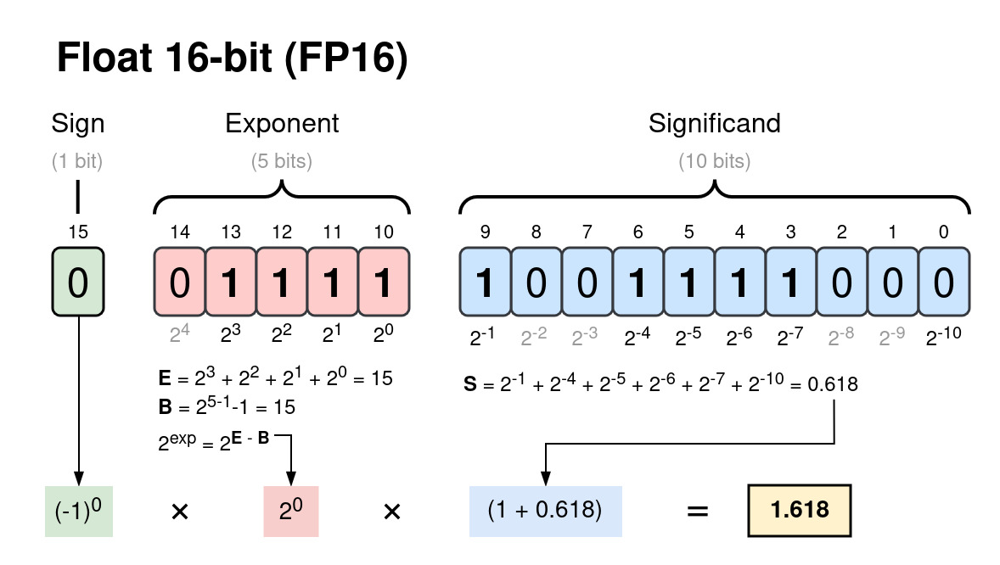
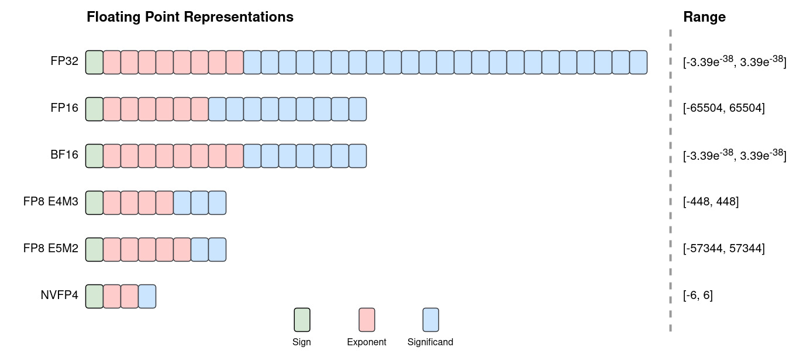
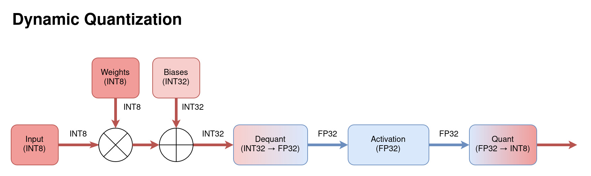
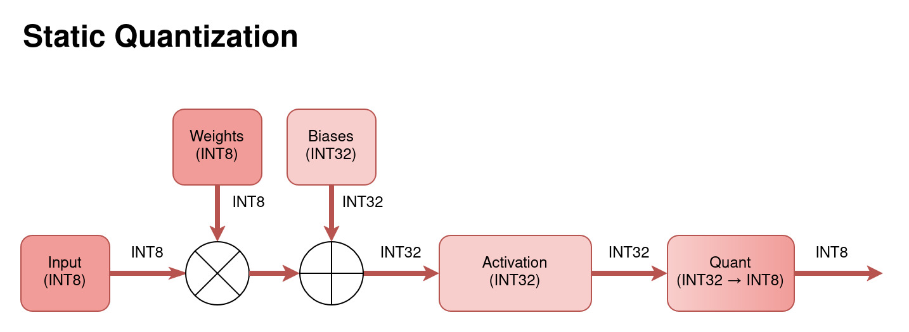
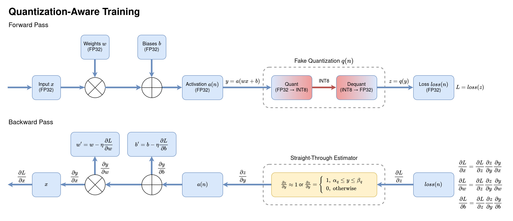
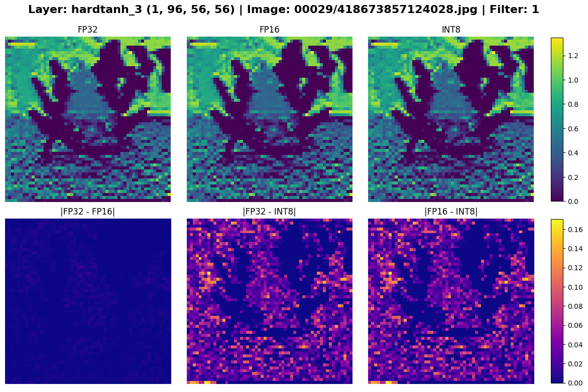
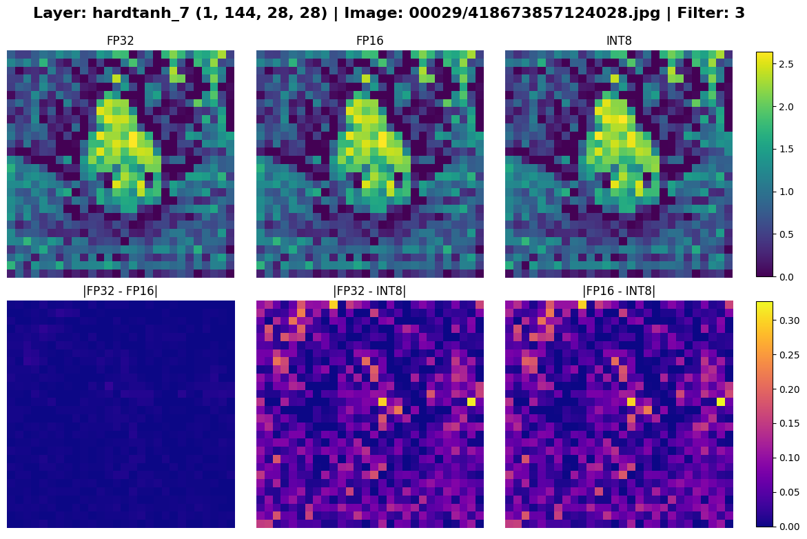
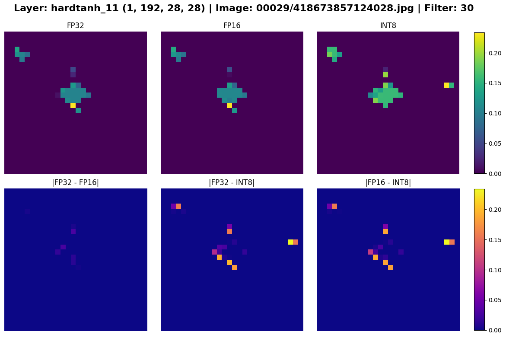
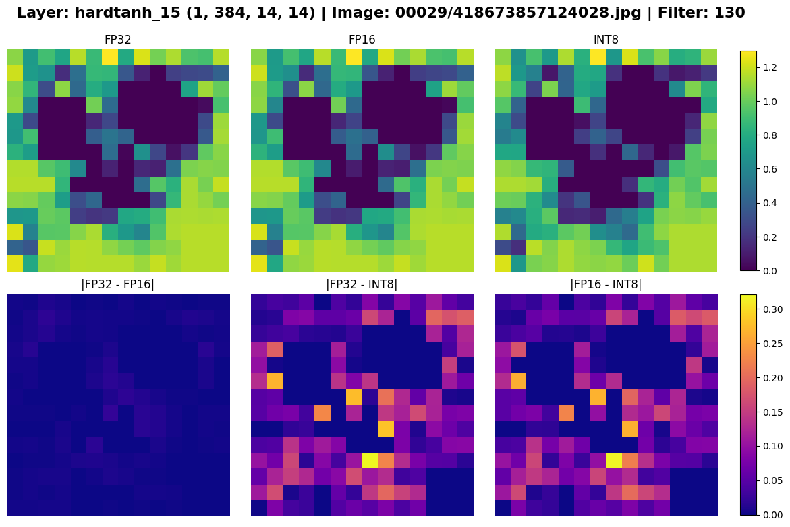
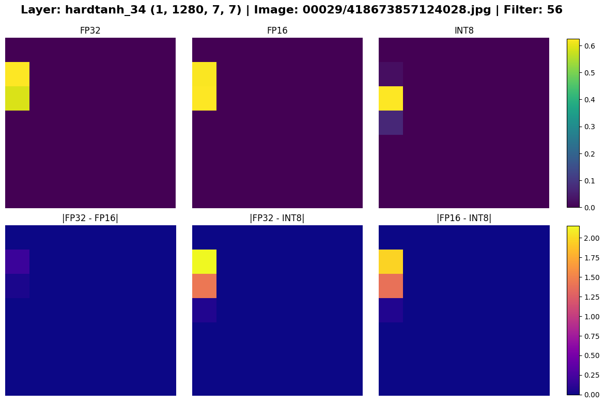

AI data centres are electricity guzzlers. According to the [International Monetary Fund](https://www.imf.org/en/blogs/articles/2025/05/13/ai-needs-more-abundant-power-supplies-to-keep-driving-economic-growth), the global data centre power consumption could reach 1,500 terawatt-hours annually by 2030. This is comparable to the energy use of India, the world's third-largest electricity user in the world. Since most data centres are powered by natural gas plants, this surge could add 1.7 gigatons of greenhouse gas emissions by the end of the decade, causing environmental damage and high energy prices. Beyond sustainability concerns, cloud AI's latency and data privacy risks make it unsuitable for real-time or high-security applications. 

In response to these challenges, the industry is pivoting toward *Edge AI*. By performing inference locally on low-power devices such as smartphones, cameras, or IoT sensors, Edge AI can make decisions almost instantly at a fraction of the energy cost. Its efficiency makes it ideal for sectors like autonomous vehicles, industrial inspection, and healthcare diagnostics, where speed and reliability are critical. As a result, the market for edge AI is projected to grow to [USD 66.65 billion by 2030](https://www.precedenceresearch.com/edge-ai-market). 

However, edge devices are designed for performance, which means you cannot run an unoptimized behemoth LLM on them. Multiple techniques have been developed to make models smaller and faster, one such technique being *quantization*. Quantization lowers the precision of models to speed up runtime computation. In this article, I want to explain the fundamentals of neural network quantization and demonstrate its effects with a practical example using the MobileNetV2 image classification model.  

## Background

Before diving into application details, we must first understand floating point representation and the basic neural network quantization scheme.

### Numerical Representation

Computers represent numbers as sequences of bits. A signed \(N\)-bit integer is represented using [Two's Complement](https://en.wikipedia.org/wiki/Two%27s_complement):


$$
\text{int}_N = -b_{N-1}2^{N-1} + \sum_{n=0}^{N-2}b_n2^n
$$

where the most significant bit (MSB) \(b_{N-1}\) has a negative weight. When the MSB is \(0\), the integer is positive, and when the MSB is \(1\), \(2^{N-1}\) is subtracted from the binary sum, pulling it into the negative range. This allows for the same hardware logic to be used for both addition and subtraction, which is highly efficient.

Floating-point numbers follow the [IEEE-754](https://en.wikipedia.org/wiki/IEEE_754) standard. Their representation can be conceptualized as [normalized binary scientific notation](https://en.wikipedia.org/wiki/Scientific_notation): 


$$
y = (-1)^S\times(1+F) \times 2^{E - B} \\
0 \le F < 1, \ \ \ \ E, \ B \in \mathbb{N}
$$

- \(S\): Sign. A single bit determining if the sign is positive or negative.
- \(F\): Fraction. The fractional part of the significand. The significand is normalized in binary, so the leading \(1\) is assumed and thus we do not need a bit to store it.
- \(E - B\): Exponent. It is a signed integer and uses a bias to represent negative values (similar to the Two's Complement above). 

In terms of bits, the float value is:


$$
\text{fp}_N = (-1)^{b_{N-1}} \times 2^{E - B}\times \left(1+\sum_{n = 1}^{F}b_{F-n}2^{-n}\right)
$$

where

$$
E = \sum_{n=0}^{K-1}b_{F+n}2^n, \ \ \ B = 2^{K-1}-1, \ \ \ N = K + F + 1
$$

- \(N\): Total bits.
- \(K\): Exponent bits.
- \(F\): Fraction bits.

For example, a 32-bit floating point (FP32) number has \(N=32, \ K = 8, \ F = 23\) and a 16-bit floating point (FP16) number has \(N=16, \ K = 5, \ F = 10\).

*Figure 1: The number 1.61803 represented as a 16-bit floating point.*

> Note: Floating-point precision is determined by the smallest possible change in the fraction. For FP16 it is 
$$
\Delta_{min} = 2^{-9}-2^{-10} = 0.000976562 \approx 0.001
$$
This means any digits beyond three decimal places of an FP16 number are essentially noise.

Common floating-point formats used in machine learning (ML), include FP32, FP16, BF16 and FP8.

*Figure 2: Common floating-point formats used in machine learning.*

### Quantization Basics

Quantization is the process of mapping a large set of values onto a smaller, discrete set. The modern standard for neural networks was formalized by Jacob et al. in their seminal 2018 [paper](https://arxiv.org/pdf/1712.05877). They introduced an integer-only quantization scheme known as *affine quantization* which maps floating-point values to integers and vice versa. 

To map a floating-point value \(x \in [\alpha, \beta]\) to an integer value \(x_q \in [\alpha_q, \beta_q] \in \mathbb{Z}\), we quantize \(x\) as follows:


$$
x_q = Q(x) = \text{clip}\left(\text{round}\left(\frac{x}{s}+z\right), \alpha_q, \beta_q\right)$$

Where:

- \(s\): Scale. A positive float that defines the step-size of the integer grid.
- \(z\): Zero-point. An integer that represents exactly \(0.0\) in the integer space. This is necessary, because \(0.0\) is frequently used in neural network array padding, so an inexact mapping would result in an accuracy drift.
- \(\text{clip}(y, a, b) = \text{min}(\text{max}(y, a), b)\)

To convert \(x_q\) back into a floating point value \(\bar{x}\), we dequantize it with


$$\bar{x} = D(x_q) = s(x_q-z), \ \ \ x = \bar{x} + \epsilon_q$$

where \(\epsilon_q\) is *quantization error* due to rounding.

Since \([\alpha,\beta] \rightarrow [\alpha_q,\beta_q]\) and \(Q(0) = z\), we can solve for \(s\) and \(z\):


$$
\begin{align}
s &= \frac{\beta - \alpha}{\beta_q - \alpha_q}\\
z &= \text{round}\left(\frac{\alpha_q\beta - \alpha\beta_q}{\beta - \alpha}\right)
\end{align}
$$

> Note: If the quantized domain is centered around zero \((\alpha_q = -\beta_q)\), the zero-point becomes \(z = 0\). This is known as *symmetric quantization*, a simplified version of affine quantization which has many performance benefits. We will discuss this type of quantization later.

## Quantizing Neural Networks

In ML, FP32 is the standard format. Its large dynamic range prevents gradient overflow or underflow, and its precision is high enough to capture tiny gradient updates during backpropagation.

However, the bits add up quickly. An LLM with 70 billion parameters stored in FP32 requires 280 GB of memory just to load the weights. Performing trillions of floating-point operations (FLOPs) with these large values is not possible even on high-end edge devies. 

>The goal of quantization is to reduce a model's memory footprint and increase its throughput by converting it to a lower-precision format. Since this process is lossy, it degrades the model's accuracy. Thus, the primary engineering challenge of quantization is balancing the performance gains against the fidelity requirements of the application.

### Float Casting

Let's ease ourselves into this challenge with *float casting*: converting FP32 values to lower-precision formats such as FP16 or BF16. While technically not quantization, casting to FP16 is an effective way to halve a model's size and double its inference speed on GPUs with optimized Tensor Cores.

FP16 is accurate enough, but it has a much smaller dynamic range than FP32, which can lead to numerical instability. [BF16](https://cloud.google.com/blog/products/ai-machine-learning/bfloat16-the-secret-to-high-performance-on-cloud-tpus) was introduced by Google Brain to circumvent this issue. It preserves the same dynamic range as FP32 with an 8-bit exponent, but loses some precision due to a shorter fraction.

### Post-Training Quantization

Quantizing a trained model is known as post-training quantization (PTQ). Both weights and activations can be quantized, but let's consider on the weights first. Since weights are frozen after training, we can calculate their quantization parameters offline.

Recall the general formulas:


$$
\begin{align}
x_q &= \text{clip}\left(\text{round}\left(\frac{x}{s}+z\right), \alpha_q, \beta_q\right)\\
\bar{x} &= s(x_q-z)
\end{align}
$$

where


$$
\begin{align}
s &= \frac{\beta - \alpha}{\beta_q - \alpha_q}\\
z &= \text{round}\left(\frac{\alpha_q\beta - \alpha\beta_q}{\beta - \alpha}\right)
\end{align}
$$

Before calculating \(s\) and \(z\) we must select the quantization *granularity*, meaning which groups of weights will share the same quantization parameters.

- **Per-tensor (per-layer)**: All values in one weight tensor use the same \(s\) and \(z\). This is memory-efficient but can introduce large errors if the data distribution is skewed.
- **Per-channel**: Every channel in a tensor (e.g. a filter in a convolution layer) has its own parameters. This isolates outliers to a single channel, reducing their impact on the tensor.
- **Per-block**: Divides the tensor into smaller blocks, each with its own \(s\) and \(z\). This results in the lowest quantization error, especially in tensors with irregular distributions, but it increases memory overhead.

Once the granularity is chosen, we must determine the floating-point range \([\alpha, \beta]\) of the weight tensor. Common algorithms include:

- **MinMax**: \(\alpha = \text{min}(w), \ \beta = \text{max}(w)\). It is simple, but highly sensitive to outliers.
- **AbsMax (Symmetric)**:  \(\alpha = -|\text{max}(w)|, \ \beta = \text{max}(w)\). This enforces \(z=0\) which simplifies and speeds up computation, but introduces large errors to asymmetric distributions.
- **Percentile**: Sets the range to a given percentile, for example \(1\%\) to \(99\%\). This clips outliers to improve the resolution of the in-distribution data.
- **Entropy (KL Divergence)**: Minimizes information loss between the FP32 and INT8 distributions.

#### Dynamic INT8 Quantization

*Figure 3: Diagram of the data flow through a dynamically quantized model.*

As mentioned earlier, weights embedded in a trained model can be quantized in advance. However, the activations are calculated for each input at runtime and so cannot be quantized offline. *Dynamic quantization* dequantizes the INT32 output of a layer into FP32 to apply the activation function, and then requantizes the output into INT8. This maintains high accuracy but the overhead of calculating quantization parameters at runtime limits performance gains.

#### Static INT8 Quantization

*Figure 4: Diagram of the data flow through a statically quantized model.*

*Static quantization* eliminates runtime overhead by quantizing both weights and activations beforehand. To do this, the model is calibrated by performing inference on a small, representative dataset. Observer functions record the statistics of the activations to pre-calculate fixed \(s\) and \(z\) values. This results in the best performance but requires a good calibration dataset to avoid significant accuracy loss.

### Quantization-Aware Training

*Figure 5: Diagram of the forward and backward pass during quantization-aware training. \(\eta\) is the learning rate.*

If static PTQ results in an unacceptable accuracy drop, *quantization-aware training* (QAT) can recover some of that loss. QAT is performed by inserting "fake quantization" nodes into the graph using the scales and zero-points calculated from calibration.

During the forward pass, these nodes simulate the rounding and clipping of INT8, thus adding the quantization error to the loss function. During the backward pass, the loss gradients \(\frac{\partial L}{\partial x}, \frac{\partial L}{\partial w}\) and \(\frac{\partial L}{\partial b}\) propagate the quantization error through the network, forcing the weights to adapt to it.

The gradient of the quantization function \(z = q(y)\) is zero almost everywhere, so to avoid propagating it, we use a *Straight-Through Estimator* (STE). STE simply approximates the gradient as \(1\), allowing gradients to flow through the network and getting the model to adapt to the quantization error. As a result, applying PTQ to a model fine-tuned with QAT yields much higher accuracy.

## MobileNetV2 Example

Let's visualize the effects of quantization on a real neural network. I used a pre-trained MobilNetV2 model due to its simple architecture and layer types that quantize easily.

The workflow involves converting the PyTorch model to ONNX and executing it with ONNXRuntime using the NVIDIA TensorRT provider. TensorRT handles the FP16 casting and INT8 static quantization internally before compiling an engine file optimized for your GPU. For INT8 calibration, I randomly selected 500 images from the 500,000 image subset of the ImageNet-1k dataset, and used the remaining 49,500 images for benchmarking. 

> Note: This example was executed using CUDA 13.2 on the NVIDIA Quadro T1000 Mobile GPU. You can find the full example code in [this Jupyter notebook](https://github.com/polinamials/quant_viz/tree/main#).

First, let's look at the sizes of the model TensorRT engines.


$$
\begin{array}{lcc}
\hline
\text{Datatype} & \text{Size (MB)} & \text{Reduction Ratio} \\
\hline
\text{FP32} & 14.3 & 1.00\times \\
\text{FP16} & 8.3 & 0.58\times \\
\text{INT8} & \mathbf{4.2} & \mathbf{0.29\times} \\
\hline
\end{array}
$$

*Table 1: MobileNetV2 engine sizes across precisions.*

The reduction in size from float casting and quantization is very close to the expected \(0.5\times\) and \(0.25\times\). However, the performance benchmarks are underwhelming:


$$
\begin{array}{lccc}
\hline
\text{Datatype} & \text{Latency (ms)} & \text{Throughput (img/s)} & \text{Speed-Up} \\
\hline
\text{FP32} & 2.3318 & 428.85 & 1.00\times \\
\text{FP16} & 2.1898 & 456.67 & 1.06\times \\
\text{INT8} & \mathbf{1.3741} & \mathbf{727.77} & \mathbf{1.70\times} \\
\hline
\end{array}
$$

*Table 2: MobileNetV2 latency and image throughput across precisions.*

In theory, FP16 and INT8 should have massive throughput gains, yet we see a mere \(1.06\times\) and \(1.70\times\) speed-up. Why? As I eventually figured out, the reason is that my old Quadro T1000 Mobile GPU does not have Tensor Cores. These specialized GPU cores are highly optimized for FP16 and INT8 matrix multiplication, whereas standard CUDA cores are optimized only for FP32 and FP64 computations. The tiny speed-up observed is likely due to reduced memory bandwidth rather than faster arithmetic.

Finally, let's compare the models' accuracy. As anticipated, the INT8 model incurred a \(1-2\%\) drop. However, contrary to expectation, FP16 slightly outperformed FP32 in all but one metrics.


$$
\begin{array}{lccc}
\hline
\text{Datatype} & \text{Accuracy} & \text{Precision} & \text{Recall} & \text{F1-Score} \\
\hline
\text{FP32} & 0.7068 & \mathbf{0.7099} & 0.7068 & 0.6826 \\
\text{FP16} & \mathbf{0.7072} & 0.7094 & \mathbf{0.7072} & \mathbf{0.6827} \\
\text{INT8} & 0.7042 & 0.6996 & 0.7039 & 0.6765 \\
\hline
\end{array}
$$

*Table 3: MobileNetV2 metrics across precisions.*

This can be explained by the fact that the lower precision of FP16 acts as a form of regularization, filtering out high-frequency noise in the weights that might otherwise cause overfitting.

*Figure 6: Sample image from the test dataset.*

But enough numbers. The most compelling evidence of quantization can be seen in the models' feature maps. In the plots below, the top row shows the feature maps of a convolution filter in a given layer for each models, and the bottom row shows the differences between the pairs of feature maps.

*Figure 7: Feature maps of layer "hardtanh_3" for different precisions.*

The delta between FP32 and FP16 is very small, whereas INT8 is noticably different from the two. In the early layers, the variances are negligible, but as data propagates deeper into the network, the small quantization errors compound. By the final layers, the models' divergence can be seen with the naked eye.

*Figure 8: Feature maps of select layers across precisions. The differences are most apparent in the last two plots.*

I wish I could have produced more illustrative performance metrics for this example, but unfortunately, my GPU had let me down. Nevertheless, I hope this example helps develop intuition for the outcomes of quantization and demonstrates some execution nuances that may contradict theoretical expectations.

## Conclusion

This brief introduction to neural network quantization covered the theory behind it from floating point representation to advanced techniques like QAT. Through our MobileNetV2 example, we visualized its effects on model outputs and observed that its performance gains are very hardware-dependent. 

Quantization is just one of the many techniques used in optimizing models for the edge. As these methods continue to evolve, making local inference more feasible, we might see a shift away from power-hungry LLMs towards more sustainable, decentralized AI.

## References

1. Jacob, Benoit, et al. ["Quantization and Training of Neural Networks for Efficient Integer-Arithmetic-Only Inference."](https://arxiv.org/pdf/1712.05877) *arXiv*, 2018.
2. Bond, Steven. ["Model Quantization: Concepts, Methods, and Why it Matters."](https://developer.nvidia.com/blog/model-quantization-concepts-methods-and-why-it-matters/) *NVIDIA Technical Blog*, NVIDIA, 21 Sept. 2023.
3. Grootendorst, Maarten. ["A Visual Guide to Quantization."](https://newsletter.maartengrootendorst.com/p/a-visual-guide-to-quantization) *Maarten’s Newsletter*, 22 Jan. 2024.
4. Mao, Lei. ["Neural Networks Quantization."](https://leimao.github.io/article/Neural-Networks-Quantization/) *Lei Mao's Logbook*, 2020.
5. ["AI Needs More Abundant Power Supplies to Keep Driving Economic Growth."](https://www.imf.org/en/blogs/articles/2025/05/13/ai-needs-more-abundant-power-supplies-to-keep-driving-economic-growth) *IMF Blog*, International Monetary Fund, 13 May 2025.
6. ["Chapter 2: Post-Training Quantization (PTQ)."]() *Practical LLM Quantization*, APXML.
7. ["2025 Edge AI Technology Report."]() *CEVA*, 2025.
8. ["Chapter 4: Quantization-Aware Training (QAT)."]() *Practical LLM Quantization*, APXML.