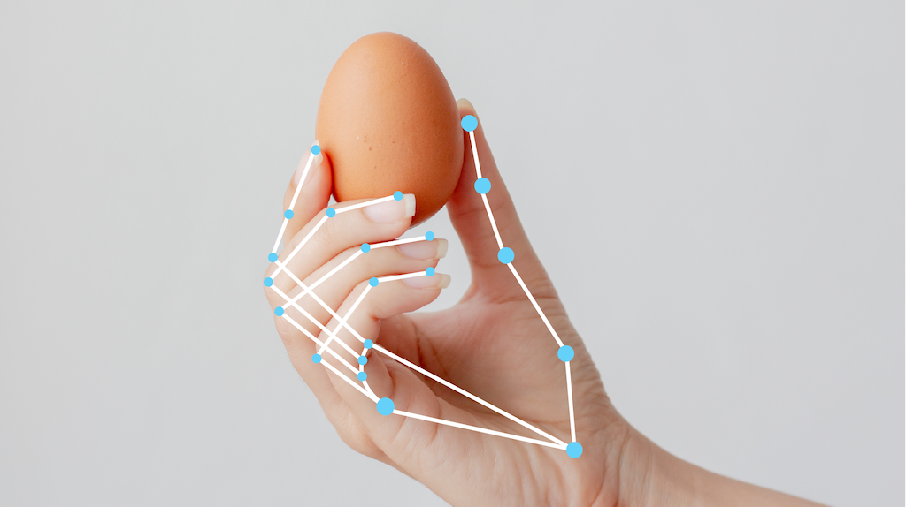
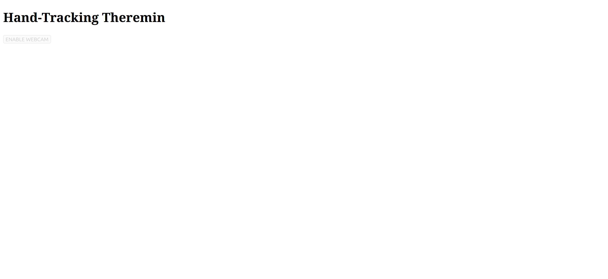
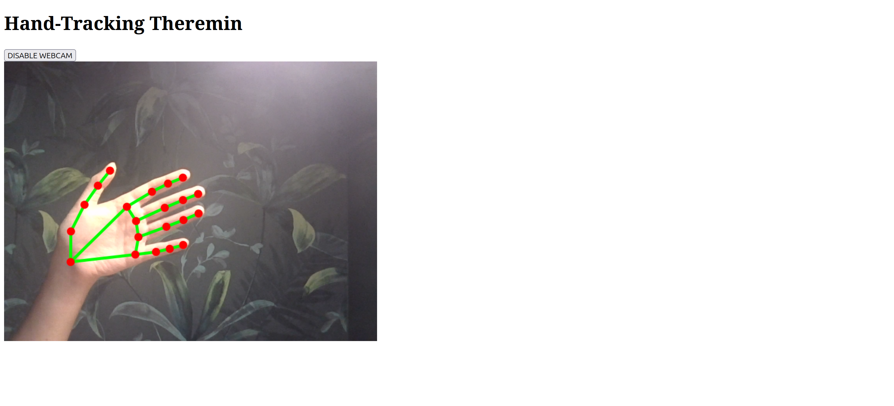
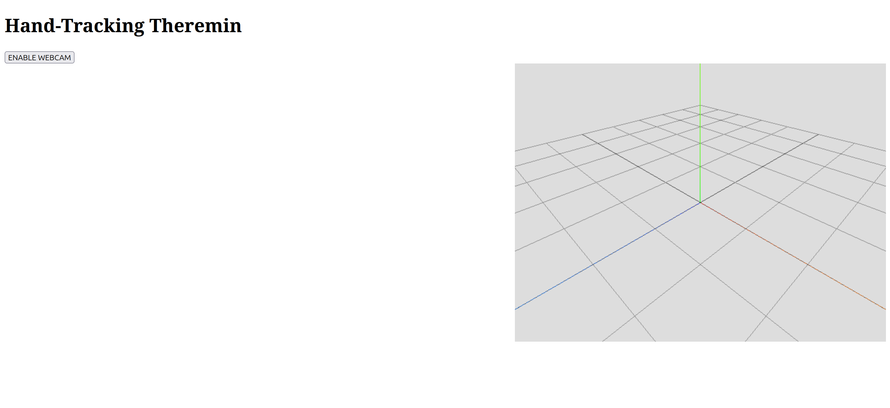

**This article is a work in progress!**

## Introduction

I recently came across the [MediaPipe Hand Landmarker](https://ai.google.dev/edge/mediapipe/solutions/vision/hand_landmarker#configurations_options) computer vision model by Google AI Edge. This is a hand-detection model which detects 21 key points of a hand in an image, and it has a fast enough inference time on a  GPU to be used for real-time tracking.



*Example of a detected hand from the [docs](https://ai.google.dev/edge/mediapipe/solutions/vision/hand_landmarker#configurations_options).*


*Diagram of the 21 hand landmarks from the [docs](https://ai.google.dev/edge/mediapipe/solutions/vision/hand_landmarker#configurations_options).*

After trying the [demo](https://mediapipe-studio.webapps.google.com/demo/hand_landmarker), I knew I wanted to use the model in a quick, fun project, however I wanted to do something a bit more original than a "gesture-controlled mouse pointer". The first thing that came to mind was... a virtual theremin.

Quick historical tangent: the [theremin](https://en.wikipedia.org/wiki/Theremin) is a musical instrument invented in 1920 by [Leon Theremin (Lev Termen)](https://en.wikipedia.org/wiki/Leon_Theremin), a Soviet engineer. The instrument works by ... and is one of the few instruments played without physical contact. 

This latter is the main reason why I decided to go with the theremin and not another instrument -- it is played without physical contact, so waving your hands in-front of the webcam would make for a failry realistic experience (at least more realistic than pretending to play the drums or guitar in thin air). 

Despite what I said about originality earlier, I'm not the first person to think of this project. After a quick web search, I found https://theremin.app/ -- a beautifully designed site that allows you to play the theremin by either using your mouse or by tracking your hands through the webcam. However, I encountered a few issues with the theremin.app implementation I wanted to fix in my version. 

First, I could not get finger-tracking to work. Second, the pitch changes are very jumpy, resulting in stoccato notes instead of the smooth, continuous sound of a real theremin. Both issues take away from the realism, which I wanted to fix. 

I also wanted to make this project an opportunity to learn more CSS and JavaScript, as well as learn more about synthesizers. Below is a step-by-step description of how you can recreate the same project. The full code on GitHub will be linked at the end.

A minimal implementation is as follows:
1. Enable webcamm and detect hand(s) in each frame.
2. Display the hands in 3D from a first-person perspective on a canvas with a 2D or 3D theremin.
3. The hands should control the pitch and volume by moving towards/away from corresponding antennas.


## Start Local HTTP Server

First, create a root directory for your project and create your `.html` and `.js` files in it. If you want to spice up your project with beautiful CSS, you can create a separate `.css` file, but since this is going to be a very minimal example, I'm not going to bother. 

```bash
theremin_project/
├── index.html
└── script.js
```
In the root directory, run the follwing command in the terminal to launch a local http server for your project.

```bash
python3 -m http.server 8000
```

You can now go to http://localhost:8000/ and view `index.html`.

## Set Up Hand Landmarker

We will follow the Hand Landmarker [code example](https://codepen.io/mediapipe-preview/pen/gOKBGPN) for the web.

Paste the following into `index.html`.

```html
<!DOCTYPE html>
<html lang="en" >
<head>
  <meta charset="UTF-8">
  <title>Hand-Tracking Theremin</title>

  <style>
    .invisible {
    opacity: 0.2;
    }
  </style>

</head>

<script src="https://cdn.jsdelivr.net/npm/@mediapipe/drawing_utils/drawing_utils.js" crossorigin="anonymous"></script>
<script src="https://cdn.jsdelivr.net/npm/@mediapipe/hands/hands.js" crossorigin="anonymous"></script>

<body>
  <h1>Hand-Tracking Theremin</h1>

  <section id="demos" class="invisible">
    
    <div id="liveView" class="videoView">
      <button id="webcamButton">
        <span >ENABLE WEBCAM</span>
      </button>
      <div style="position: relative;">
        <video id="webcam" style="position: abso" autoplay playsinline></video>
        <canvas class="output_canvas" id="output_canvas" style="position:
        absolute; left: 0px; top: 0px;"></canvas>
      </div>
    </div>
  </section>
<!-- partial -->
  <script type="module" src="./script.js"></script>

</body>
</html>
```

In the browser, your page should look like below.



Make sure that you are importing the MediaPipe scripts 

```html
<script src="https://cdn.jsdelivr.net/npm/@mediapipe/drawing_utils/drawing_utils.js" crossorigin="anonymous"></script>
<script src="https://cdn.jsdelivr.net/npm/@mediapipe/hands/hands.js" crossorigin="anonymous"></script>
```
before importing your own `script.js`:

```html
<!-- partial -->
  <script type="module" src="./script.js"></script>
```

I will explain the `.invisible` CSS in a moment.

Now paste the following code into `script.js`.

```javascript
import { HandLandmarker, FilesetResolver } from "https://cdn.jsdelivr.net/npm/@mediapipe/tasks-vision@0.10.0";
const demosSection = document.getElementById("demos");
let handLandmarker = undefined;
let runningMode = "IMAGE";
let enableWebcamButton;
let webcamRunning = false;
let rafID = null;
// Before we can use HandLandmarker class we must wait for it to finish
// loading. Machine Learning models can be large and take a moment to
// get everything needed to run.
const createHandLandmarker = async () => {
    const vision = await FilesetResolver.forVisionTasks("https://cdn.jsdelivr.net/npm/@mediapipe/tasks-vision@0.10.0/wasm");
    handLandmarker = await HandLandmarker.createFromOptions(vision, {
        baseOptions: {
            modelAssetPath: `https://storage.googleapis.com/mediapipe-models/hand_landmarker/hand_landmarker/float16/1/hand_landmarker.task`,
            delegate: "GPU"
        },
        runningMode: runningMode,
        numHands: 2
    });
    demosSection.classList.remove("invisible");
};
createHandLandmarker();

const video = document.getElementById("webcam");
const canvasElement = document.getElementById("output_canvas");
const canvasCtx = canvasElement.getContext("2d");
// Check if webcam access is supported.
const hasGetUserMedia = () => { var _a; return !!((_a = navigator.mediaDevices) === null || _a === void 0 ? void 0 : _a.getUserMedia); };
// If webcam supported, add event listener to button for when user
// wants to activate it.
if (hasGetUserMedia()) {
    enableWebcamButton = document.getElementById("webcamButton");
    enableWebcamButton.addEventListener("click", event => {
  if (!webcamRunning) {
        // turn webcam off;
        enableCam();
    } else {
        // turn webcam off
        disableCam();
    }
    });
}
else {
    console.warn("getUserMedia() is not supported by your browser");
}
// Enable the live webcam view and start detection.
async function enableCam(event) {
    if (!handLandmarker) {
        console.log("Wait! objectDetector not loaded yet.");
        return;
    }
    webcamRunning = true;
    enableWebcamButton.innerText = "DISABLE WEBCAM";

    // getUsermedia parameters.
    const constraints = {
        video: true
    };
    // Activate the webcam stream.
    await handLandmarker.setOptions({ runningMode: "VIDEO" });
    navigator.mediaDevices.getUserMedia(constraints).then((stream) => {
        video.srcObject = stream;
        video.addEventListener("loadeddata", predictWebcam);
    });
}

// Disable webcam
function disableCam() {
    if (video.srcObject) {
        video.srcObject.getTracks().forEach(track => track.stop());
        video.srcObject = null;

        if (rafID) {
            cancelAnimationFrame(rafID);
            rafID = null;
        }
        //cancelAnimationFrame(-1);
        video.removeEventListener("loadeddata", predictWebcam)
    }

    canvasCtx.clearRect(0, 0, canvasElement.width, canvasElement.height);

    webcamRunning = false;
    enableWebcamButton.innerText = "ENABLE WEBCAM";
}

let lastVideoTime = -1;
let results = undefined;
console.log(video);
async function predictWebcam() {

    canvasElement.style.width = video.videoWidth;
    canvasElement.style.height = video.videoHeight;
    canvasElement.width = video.videoWidth;
    canvasElement.height = video.videoHeight;

    // Now let's start detecting the stream.
    let startTimeMs = performance.now();
    if (lastVideoTime !== video.currentTime) {
        lastVideoTime = video.currentTime;
        results = handLandmarker.detectForVideo(video, startTimeMs);
    }
    canvasCtx.save();
    canvasCtx.clearRect(0, 0, canvasElement.width, canvasElement.height);
    if (results.landmarks) {
        for (const landmarks of results.landmarks) {
            drawConnectors(canvasCtx, landmarks, HAND_CONNECTIONS, {
                color: "#00FF00",
                lineWidth: 5
            });
            drawLandmarks(canvasCtx, landmarks, { color: "#FF0000", lineWidth: 2 });
        }
    }
    canvasCtx.restore();
    // Call this function again to keep predicting when the browser is ready.
    if (webcamRunning === true) {
        rafID = window.requestAnimationFrame(predictWebcam);
    }
}
```

Click the ENABLE WEBCAM button, allow webcam permissions, and you should see something like this.



If you click DISABLE WEBCAM, the webcam should shut down. You should be able to re-enable it without error. The code is somewhat easy to understand, but let here's one important part:

```javascript
let rafID = null;

// ...

function disableCam() {
    if (video.srcObject) {
        // ...

        if (rafID) {
            cancelAnimationFrame(rafID);
            rafID = null;
        }
        // ...
    }

    // ...
}

// ... 

async function predictWebcam() {
    // ...
    if (webcamRunning === true) {
        rafID = window.requestAnimationFrame(predictWebcam);
    }
}

```

When disabling the webcam, you must cancel the last frame by its ID (`rafID`), otherwise upon re-enabling the camera you will get this error:

```bash
Uncaught (in promise) Error: WaitUntilIdle failed: $CalculatorGraph::Run() failed in Run: 
Calculator::Process() for node "mediapipe_tasks_vision_hand_landmarker_handlandmarkergraph__mediapipe_tasks_vision_hand_detector_handdetectorgraph__mediapipe_tasks_components_processors_imagepreprocessinggraph__ImageToTensorCalculator" failed: RET_CHECK failure (third_party/mediapipe/calculators/tensor/image_to_tensor_utils.cc:56) roi->width > 0 && roi->height > 0 ROI width and height must be > 0.; WaitUntilIdle failed
```
This minimal implementation of Hand Landmarker should be enough to get you started. However, let's take it further and have the hands display from a first-person perspective in a separate 3D canvas using Three.js.

## Add Three.js 3D Canvas

Add the following code to the `<head>` of `index.html`:

```html
<script type="importmap">
        {
            "imports": {
                "three": "https://cdn.jsdelivr.net/npm/three@0.152.2/build/three.module.js",
                "three/addons/": "https://cdn.jsdelivr.net/npm/three@0.152.2/examples/jsm/"
            }
        }
</script>
```

Then import Three.js in `script.js` below your Hand Landmarker import:

```javascript
import * as THREE from 'three';
import { OrbitControls }  from 'three/addons/controls/OrbitControls.js';
```

Let's edit `index.html` to create a second canvas for 3D rendering next to of the webcam stream. Edit the `liveView` container to add a new canvas below `output_canvas`:

```html
<canvas class="output_canvas" id="output_canvas" style="position:
absolute; left: 0px; top: 0px;"></canvas>
<!-- added the new canvas below -->
<canvas class="canvas3d" id="canvas3d" style="position:
absolute; right: 0px; top: 0px;"></canvas>

```

Now let's connected Three renderer to `canvas3d`. Add the following code to `script.js` after where you add the listener event to the ENABLE WEBCAM button:

```javascript
// ----- Three.js setup -----

// Scene
const scene = new THREE.Scene();

let width = 640; // you can change this to whatever you want
let height = 480;

// Camera
const camera   = new THREE.PerspectiveCamera(60, 1, 0.01, 10);
camera.position.set(0.5, 0.5, 0.5);
camera.lookAt(0,0,0);
camera.aspect = width/ height;
camera.updateProjectionMatrix();

// Renderer
const canvas3D = document.getElementById("canvas3d");
const renderer = new THREE.WebGLRenderer({alpha: true, canvas: canvas3D});
renderer.setClearColor(0xdddddd, 1);
renderer.setSize(width, height, true);

// size of the helpers in world units
const helperSize = 2;
const gridDivisions =10;

// grid
const gridHelper = new THREE.GridHelper(helperSize, gridDivisions);
scene.add(gridHelper);

// axes
const axesHelper = new THREE.AxesHelper(helperSize);
scene.add(axesHelper);

// OrbitControls
const controls = new OrbitControls( camera, renderer.domElement );
controls.update();
```

You should see something like the image below. You should be able to rotate, pan and zoom the rendered scene using left-click, right-click and scroll wheel, respectively.



It's later going to be important to know which axis is which, so remember:
- X: red
- Y: green
- Z: blue

## Render Hand Landmarks in 3D

Now we will edit `predictWebcam()` to display the hand landmarks in 3D. First, add these imports to the top of `script.js`

```javascript
import { LineSegments2 }      from 'three/addons/lines/LineSegments2.js';
import { LineMaterial }       from 'three/addons/lines/LineMaterial.js';
import { LineSegmentsGeometry } from 'three/addons/lines/LineSegmentsGeometry.js';
```

Next, add this code below your renderer set-up code:

```javascript
// Hands geometry
const lineSegWidth = 0.01;

// Hand 1
const skeletonGeom1 = new LineSegmentsGeometry();
const skeletonMat1  = new LineMaterial({
  color:       0xff0000, // red color
  linewidth:   lineSegWidth,    // 0.005 world units thick
  worldUnits:  true
});
const skeletonMesh1 = new LineSegments2(skeletonGeom1, skeletonMat1);
scene.add(skeletonMesh1);

// Hand 2
const skeletonGeom2 = new LineSegmentsGeometry();
const skeletonMat2  = new LineMaterial({
  color:       0x0000ff, // blue color
  linewidth:   lineSegWidth,
  worldUnits:  true
});
const skeletonMesh2 = new LineSegments2(skeletonGeom2, skeletonMat2);
scene.add(skeletonMesh2);

// get renderer size
const size = new THREE.Vector2();
renderer.getSize(size);

// Set resolution to match renderer size
skeletonMat1.resolution.set(size.x, size.y);
skeletonMat2.resolution.set(size.x, size.y);
```

This code creates two meshes -- one for each hand. For clarity, I made the first one red and the second one blue, but you can choose any color. Next we need to understand what results the Hand Landmarker actually returns. Quoting from the [docs](https://ai.google.dev/edge/mediapipe/solutions/vision/hand_landmarker#configurations_options):

> - **Landmarks:** There are 21 hand landmarks, each composed of x, y and z coordinates. The x and y coordinates are normalized to [0.0, 1.0] by the image width and height, respectively. The z coordinate represents the landmark depth, with the depth at the wrist being the origin. The smaller the value, the closer the landmark is to the camera. The magnitude of z uses roughly the same scale as x.
> - **World Landmarks:** The 21 hand landmarks are also presented in world coordinates. Each landmark is composed of x, y, and z, representing real-world 3D coordinates in meters with the origin at the hand’s geometric center.

```yaml
HandLandmarkerResult:
  Handedness:
    Categories #0:
      index        : 0
      score        : 0.98396
      categoryName : Left
  Landmarks:
    Landmark #0:
      x            : 0.638852
      y            : 0.671197
      z            : -3.41E-7
    Landmark #1:
      x            : 0.634599
      y            : 0.536441
      z            : -0.06984
    ... (21 landmarks for a hand)
  WorldLandmarks:
    Landmark #0:
      x            : 0.067485
      y            : 0.031084
      z            : 0.055223
    Landmark #1:
      x            : 0.063209
      y            : -0.00382
      z            : 0.020920
    ... (21 world landmarks for a hand)
```

After experimenting with the different co-ordinate readings, this is what we're going to do: the hands will move in 3D *locally*, about the wrist (landmark #0). However *globally* they will move in the x-y plane only. Add these two helper functions:

```javascript
function getHandPoints(results, hand_index, pts){

    const moving_origin = results.landmarks[hand_index][0];
    const hand3D = results.worldLandmarks[hand_index];
    const wrist = hand3D[0];

    for (const [i, j] of HAND_CONNECTIONS) {
        const A = hand3D[i], B = hand3D[j];

        pts.push(A.x, A.y, A.z, B.x, B.y, B.z);
    }
}

function updateHandSkeleton(geom, mesh, pts){
    geom.setPositions(pts);
    mesh.rotation.y = Math.PI;
    mesh.updateMatrixWorld();
    geom.computeBoundingSphere();

}
```

Then edit `predictWebcam` as follows:

```javascript
async function predictWebcam() {

    canvasElement.style.width = video.videoWidth;
    canvasElement.style.height = video.videoHeight;
    canvasElement.width = video.videoWidth;
    canvasElement.height = video.videoHeight;

    // Now let's start detecting the stream.
    let startTimeMs = performance.now();
    if (lastVideoTime !== video.currentTime) {
        lastVideoTime = video.currentTime;
        results = handLandmarker.detectForVideo(video, startTimeMs);
    }
    canvasCtx.save();
    canvasCtx.clearRect(0, 0, canvasElement.width, canvasElement.height);
    if (results.landmarks) {
        for (const landmarks of results.landmarks) {
            drawConnectors(canvasCtx, landmarks, HAND_CONNECTIONS, {
                color: "#00FF00",
                lineWidth: 5
            });
            drawLandmarks(canvasCtx, landmarks, { color: "#FF0000", lineWidth: 2 });
        }

        // ----- Added this -----
        skeletonMesh1.visible = true;
        skeletonMesh2.visible = true;

        const pts1 = [];
        const pts2 = [];

        if (results.landmarks.length === 1){
            getHandPoints(results, 0, pts1);
            updateHandSkeleton(skeletonGeom1, skeletonMesh1, pts1);
        }
        else if (results.landmarks.length === 2){

            getHandPoints(results, 0, pts1);
            getHandPoints(results, 1, pts2);

            updateHandSkeleton(skeletonGeom1, skeletonMesh1, pts1);
            updateHandSkeleton(skeletonGeom2, skeletonMesh2, pts2);
        }
        else{
            // handle the situation when there are more than two hands.
        }

    }
    else{
        skeletonMesh1.visible = false;
        skeletonMesh2.visible = false;
    }
    // -------------------------------
    
    canvasCtx.restore();
    // Call this function again to keep predicting when the browser is ready.
    if (webcamRunning === true) {
        rafID = window.requestAnimationFrame(predictWebcam);
    }
}
```

At this point, we don't really need to draw the landmarks on the 2D canvas. You may want to remove the 2D landmark drawing code and the 2D canvas alltogether, but you don't have to. I will remove it in this example to prevent clutter. 

You might notice that while the two hands appear to be moving in 3D, they are fixed at the origin. This is precisely because "each landmark is composed of x, y, and z, representing real-world 3D coordinates in meters with the origin at the hand’s geometric center," as said in the docs. 

## Import Theremin 3D Model
## Calculated Distances To Antennas
## Add Sound With Tone.js
## Conclusion
