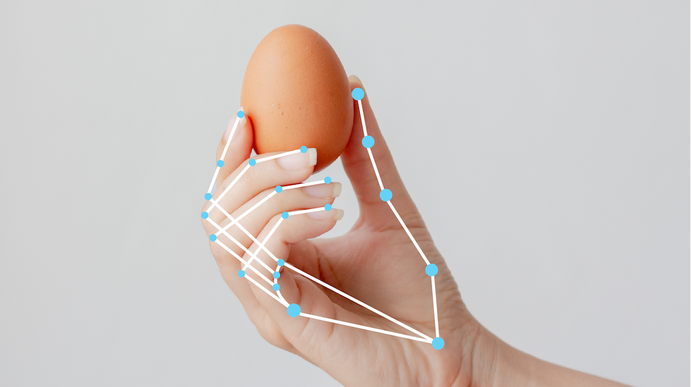
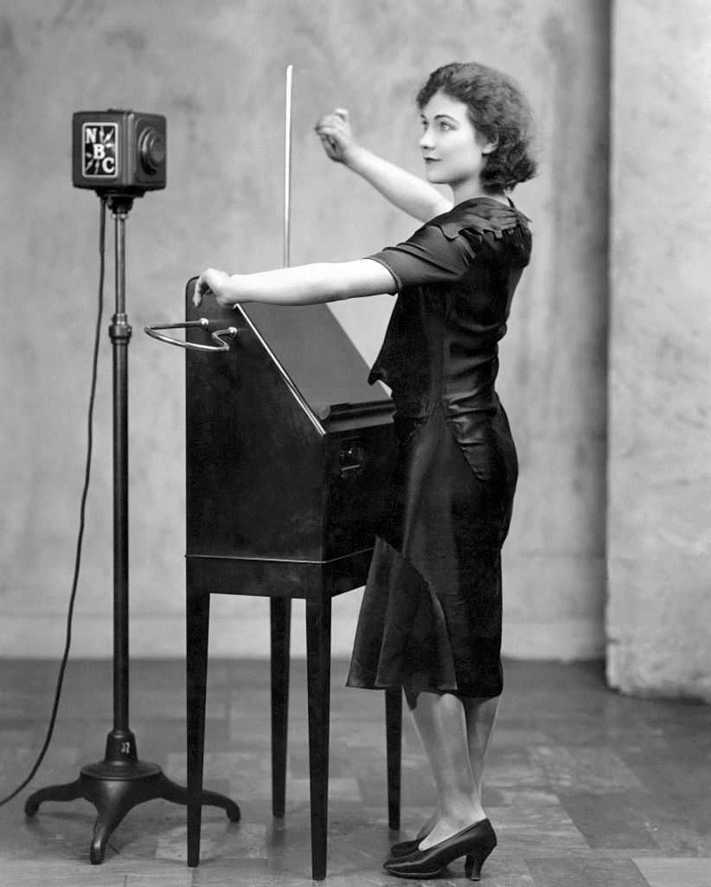

I recently came across the [MediaPipe Hand Landmarker](https://ai.google.dev/edge/mediapipe/solutions/vision/hand_landmarker#configurations_options) computer vision model by Google AI. This is a hand-detection model that detects 21 key points of a hand in an image, and it is fast enough for real-time tracking.

*Example of a detected hand from the [docs](https://ai.google.dev/edge/mediapipe/solutions/vision/hand_landmarker#configurations_options).*

*Diagram of the 21 hand landmarks from the [docs](https://ai.google.dev/edge/mediapipe/solutions/vision/hand_landmarker#configurations_options).*

After trying the in-browser webcam [demo](https://mediapipe-studio.webapps.google.com/demo/hand_landmarker), I knew I wanted to use the model in a quick, fun project. However, I wanted to do something a bit more original than a "gesture-controlled mouse pointer," and the first thing that came to mind was a virtual theremin.

*Alexandra Stepanoff playing the theremin on NBC Radio ([Wikipedia](https://en.wikipedia.org/wiki/Theremin#/media/File:Theramin-Alexandra-Stepanoff-1930.jpg))*

The [theremin](https://en.wikipedia.org/wiki/Theremin) is a musical instrument invented in 1920 by [Leon Theremin (Lev Termen)](https://en.wikipedia.org/wiki/Leon_Theremin), a Soviet engineer, and it is one of the few instruments played without physical contact. 

The instrument works by the [heterodyning](https://en.wikipedia.org/wiki/Heterodyne) of two high-frequency oscillators. The reference oscillator operates at a fixed frequency, while the near-identical frequency of the input oscillator is controlled by the distance from the performer's hand to the pitch antenna. The hand and the antenna act as the two plates of a capacitor in the L-C circuit of the input oscillator. Varying the distance between them changes the capacitance, and thus slightly shifts the oscillator's frequency. When the two signals are mixed, their difference frequency falls in the audible range, creating an eerie sound. A similar setup is used for controlling the instrument's volume with another antenna. 

The main reason why I decided to go with the theremin and not another instrument is because it is played without physical contact, so waving your hands in front of the webcam would make for a somewhat realistic experience (at least more realistic than pretending to play the drums or guitar in thin air). 

Despite what I said about originality earlier, I'm not the first person to think of a virtual theremin. After a quick web search, I found https://theremin.app/ -- a beautifully designed site that allows you to play the theremin by either using your mouse or by tracking your hands through the webcam. However, I encountered a few issues with the theremin.app implementation I wanted to fix in my version. 

First, I could not get finger-tracking to work on the site. Only the less precise wrist-tracking is currently working, and it is very slow. Second, the pitch changes are quite jumpy, resulting in staccato notes instead of the smooth, continuous sound of a real theremin.

I was able to fix these problems in my implementation. The Hand Landmarker is fast and works well for tracking subtle changes in finger position. I also achieved much smoother frequency transitions with the [Tone.js](https://tonejs.github.io/) library. 

You can try my demo [here](https://issledova.tel/posts/theremin_demo/) and see the source code on [GitHub](https://github.com/polinamials/virtual_theremin).
