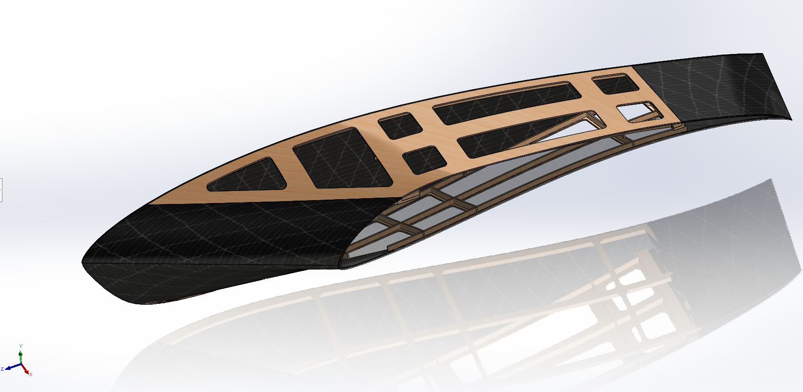
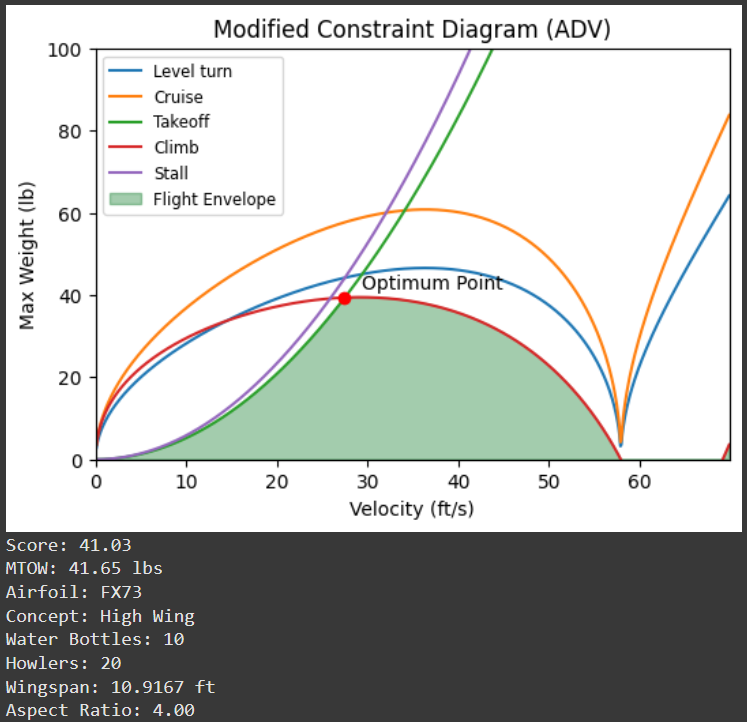

## Top Skills Used

- SolidWorks 3D CAD
- Aerodynamic constraint analysis
- Parameter optimization using Python
- Team leadership and collaboration
        

## Project Overview

I was a member of the [UBC AeroDesign](https://www.ubcaerodesign.com/) team, which designs and builds remote-controlled aircraft for the [SAE Aero Design competition](https://saeaerodesign.com/). As the Advanced Class fuselage subteam lead, I designed a portion of the fuselage in SolidWorks and wrote a Python script to perform aerodynamic constraint analysis and parameter optimization. This helped us identify parameters that would maximize our score at the competition.

  

*My fuselage transition region design. It creates a smooth transition between complex airfoil shapes, using carbon fibre and balsa wood.*

*Render of the Advanced Class aircraft. The transition region is situated between the main fuselage and the wing.*

 

*Output of the Python parameter optimization script. These identified parameters would maximize our SAE competition score.*

 
 
*Team photo.*
