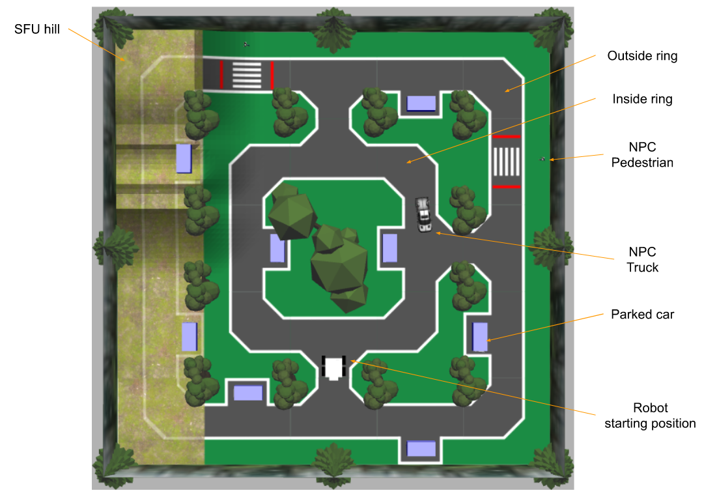
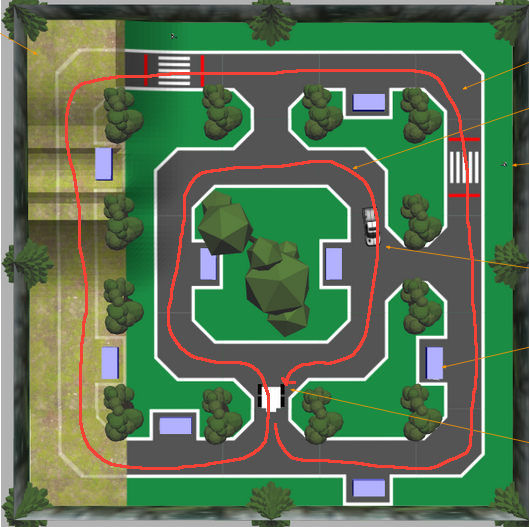
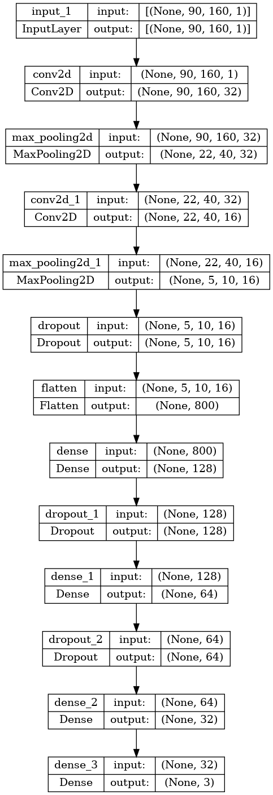
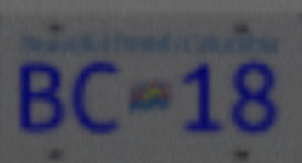
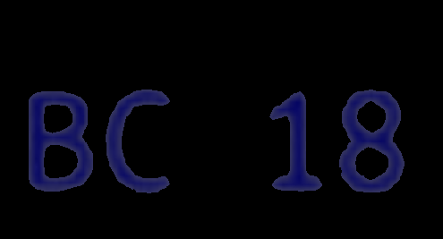
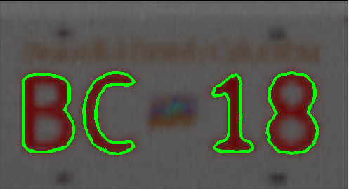
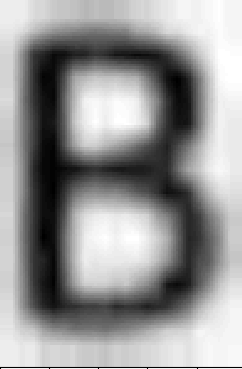

## Top Skills Used

- ROS, Gazebo
- Machine learning
- Computer vision
- Python data pipelines
- Data augmentation

## Project Overview

As part of a machine learning course [ENPH 353](https://projectlab.engphys.ubc.ca/enph-353/), I worked in a team of two to train a virtual autonomous agent to navigate a 3D simulated obstacle course. The goal was to drive
around the virtual environment, identify parked cars, and accurately
read their licence plates using computer vision — all completely
autonomously. Our code repository for this project is available on
my [GitHub](https://github.com/polinamials/ENPH353_Team7).

The simulation was set up in Gazebo Gym and included parked cars
along the roadside, pedestrians crossing randomly, and a moving NPC
truck. Our objective was to complete the course as quickly as
possible while correctly reading all eight randomly generated
plates. Points were taken away for driving off the road or colliding
with obstacles, so precise navigation and perception were crucial.
        

  

*An overview of the virtual obstacle course.*

  

*The route our virtual car followed around the course.*

To achieve autonomous driving, we employed imitation learning.
First, we controlled the agent manually using ROS, collecting
thousands of images from the agent’s cameras alongside our control
inputs (turn left, turn right, or go straight). This dataset was
then used to train a convolutional neural network that predicted
steering commands based on the camera input. Our inspiration came
from how Tesla [trains](https://youtu.be/0AwMqjGZMyk) its
autonomous driving systems.

<video controls width="640" height="360">
  <source src="driving_compatible.mp4" type="video/mp4">
  Your browser does not support the video tag. Please update your browser or [download the video](driving_compatible.mp4).
</video>  

*Processed camera feed from the agent’s cameras used for training the CNN.*

 

*The CNN architecture predicting the agent’s steering commands.*

We also used computer vision techniques to detect and read the car plates. After identifying the plates, we used another 
neural network trained on augmented data to recognize the characters. This was challenging due to the  
blurriness of the plate images. To improve accuracy, we averaged results across multiple frames of the same plate.
        

 

*A detected plate, unprocessed.*

  

*Extracting blue text from the plate.*

  

*Segmenting individual symbols from the plate text.*

 
 
*A processed symbol ready for input into the character‑recognition network.*

In the end, our efforts paid off: we correctly identified all car plates during the competition. While our agent wasn’t the 
quickest to navigate the obstacle course, my partner and I were very happy with our precision and consistency in reading the plates. 
This project inspired me to study machine learning further. In the following semester, I became a teaching assistant 
for this course and got to learn the material at an even deeper level.