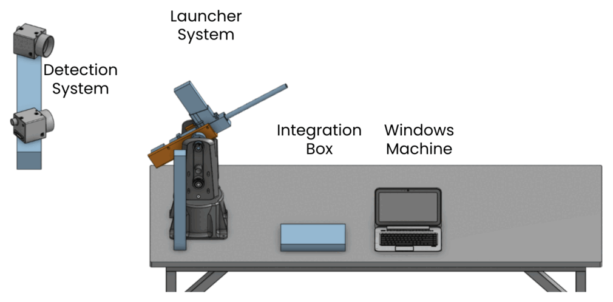
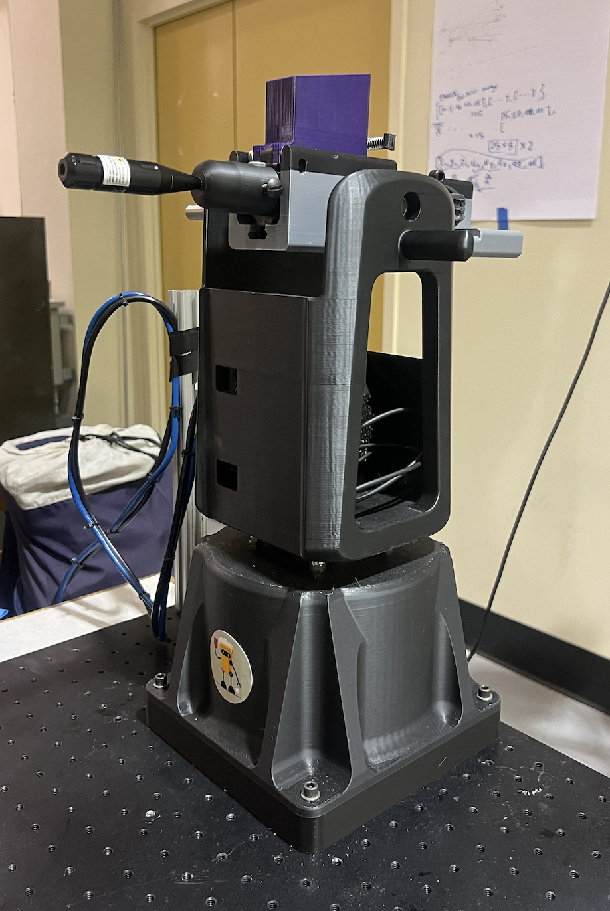
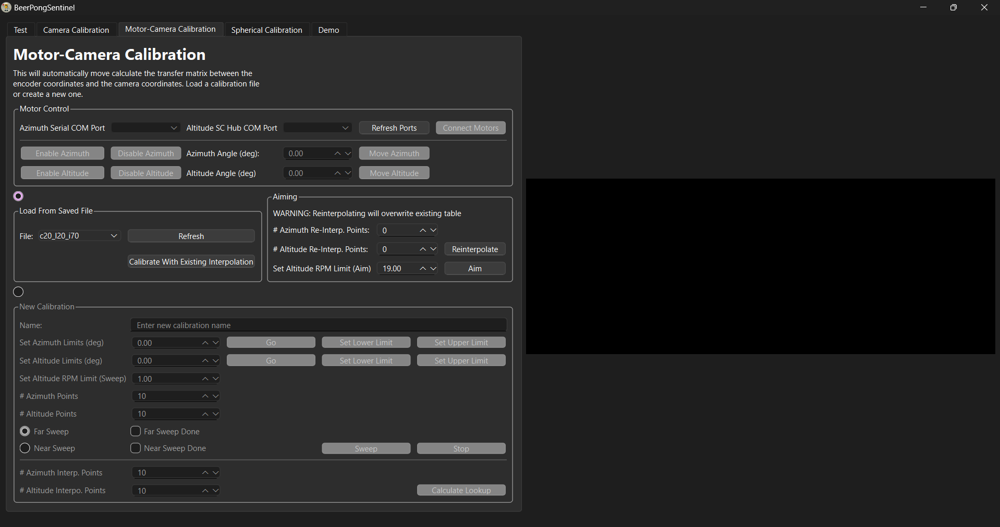

## Top Skills Used

-  Computer vision
-  Real-time stereo vision
-  Predictive algorithms
-  C++ GUI application development
-  Motor control

## Introduction

I built an automated beer pong opponent for my senior year capstone project [(ENPH 479)](https://projectlab.engphys.ubc.ca/enph-459-479/) as part of a four-person team. Our objective was to design and build a system that can predict the trajectory of a ball thrown toward a “solo cup” and intercept it mid-flight by shooting pellets from an airsoft gun. The basic operation is shown in the system diagram.

  

*System diagram.*

## Overview

This project had two main parts: a stereo computer vision system built with two [FLIR](https://www.flir.ca/) cameras, allowing for real-time 3D trajectory estimation, and the launcher itself, actuated by two stepper encoder motors. The main challenge of this project was the integration between the two. How do the motors know where to move to based on what the cameras are seeing? This is known as the [hand-eye calibration problem](https://en.wikipedia.org/wiki/Hand%E2%80%93eye_calibration_problem) in robotics, and it was one of the most fun puzzles I’ve ever solved.

This was a very complex project and there is A LOT to talk about, so I encourage you to check out our [landing-page GitHub](https://github.com/Beer-Pong-Sentinel/BeerPongSentinelMainframe) and our [main code repository](https://github.com/Beer-Pong-Sentinel/BeerPongSentinel) for more (perhaps too much) detail. Nevertheless, here is a brief summary:

- Created the mechanical design in CAD (OnShape) and built it using 3D-printed parts and off-the-shelf components optimized for high-torque loads.  
- Built a high-precision stereo vision system using FLIR cameras, Spinnaker SDK, and OpenCV, controlled by a C++ Qt6 GUI application.  
- Implemented a unique calibration to convert stereo coordinates to motor orientation coordinates, solving the hand-eye calibration problem.  
- Trained and integrated a YOLOv8 model for object detection and accelerated image processing 10x using CUDA for real-time performance.  

  

*Assembled system in real life.*

 
 
*Qt GUI application interface.*

<video controls>
  <source src="Aiming.mp4" type="video/mp4">
  Your browser does not support the video tag. Please update your browser or [download the video](Aiming.mp4).
</video>  

*Demonstration of our launcher aiming at a static tennis ball with a laser pointer. The laser dot on the ball is difficult to see in the video, but it shows up most clearly at 0:05.*
