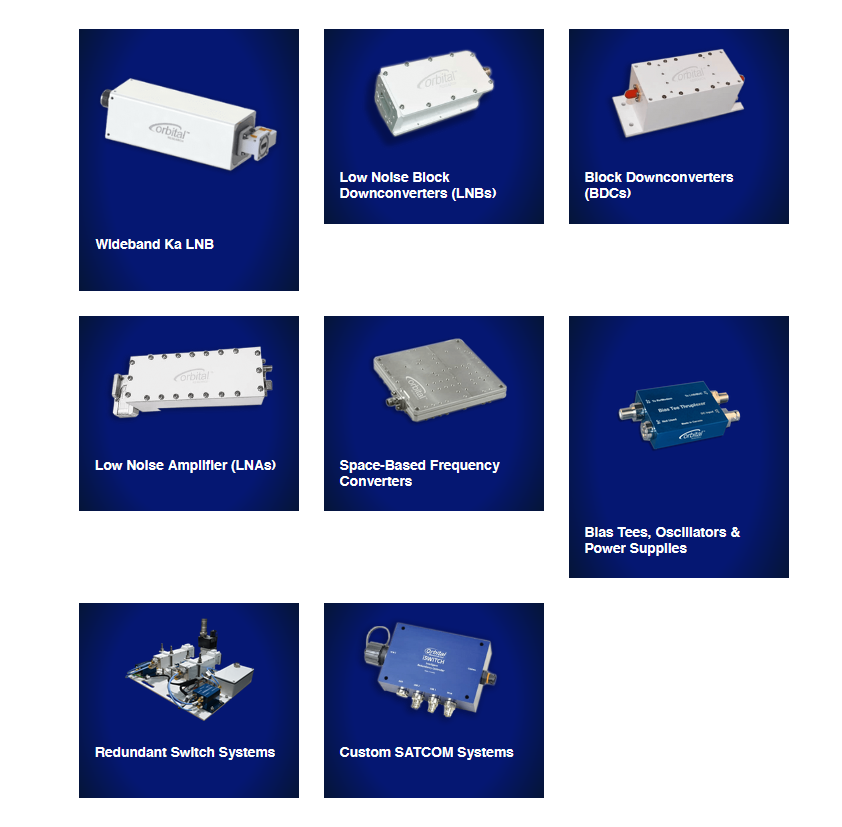

## Top Skills Used

- SolidWorks 3D CAD and PDM
- Design for manufacturing
- SolidWorks drawings and GD&T
- FEA simulations
- Machine shop tools (laser engraver, mill, drill, saw)
- IP and vibration testing
- Programmable instruments control
- Quality control

## Project Overview

I worked as a mechanical engineering intern and later as a part-time employee at [Orbital Research Ltd.](https://orbitalresearch.net/), a company specializing in satellite communication devices, such as low-noise block up/down converters and precision local oscillators.

At Orbital Research, I designed parts for RF receivers, transmitters, and other devices using SolidWorks. I created detailed machine shop drawings, adhering to GD&T standards, and communicated with the shop to ensure quality manufacturing. I also designed complex outdoor unit assemblies and produced assembly drawings for customers.

One highlight involved making mechanical modifications to existing devices to meet specific customer requirements. I took initiative in this project by designing the changes in SolidWorks, fabricating them using machine shop tools, and communicating with the client. The finalized prototypes were delivered on time, achieving customer satisfaction.

Beyond design and manufacturing, I also conducted IP and vibration testing on the Orbital devices. I built a vibration testing jig and developed a user-friendly Python GUI to operate it. The setup included a vibration table, a function generator, and an oscilloscope. My software ensured that the output vibration profile matched the input profile through transfer function calibration.

I am really grateful for the opportunities I had at Orbital Research, as they allowed me to expand my skillset beyond mechanical design and into various other areas of engineering.

  

*Orbital Research Ltd.*

  

*Examples of Orbital Research products from their [product page](https://orbitalresearch.net/products/).*
