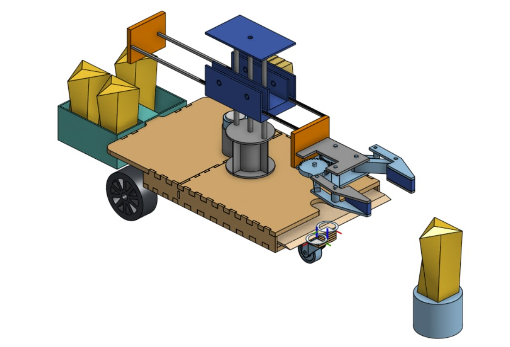

## Top Skills Used

- Onshape 3D CAD
- 3D printing
- Laser cutting
- Motor control
- Sensor integration
- Microcontroller programming in C
- Electrical circuitry and soldering

## Project Overview

During a summer course called [Robot Summer (ENPH 253)](https://projectlab.engphys.ubc.ca/) at UBC, my team of four built a fully autonomous robot for a student [competition](https://www.youtube.com/watch?v=ruz6v9-TYMs&t=3s). This was one of the most exciting and challenging projects I’ve ever undertaken.

Our goal was to design a robot that could navigate a complex obstacle course and use a claw mechanism to collect and store “treasures” to deliver them to a designated drop-off zone. The project timeline was about six weeks, and we were limited to basic electrical components and materials. We built our own H‑bridge circuits and even manufactured our own gears.

I designed the base platform in Onshape and integrated the CAD models from other team members. The base parts were laser‑cut from fibreboard and the robot’s two driving wheels were powered by encoder motors. I implemented differential drive to allow for tight turns throughout the obstacle course.

  

*The Onshape CAD assembly I created for the robot.*

  

*Our completed robot, nicknamed “Gluey” due to our generous use of hot glue to keep it together.*

  

*The treasure basket located at the back of the robot.*

The first part of the course involved following a line of black tape. I built a circuit using IR reflectivity sensors to detect the tape, and working with another teammate, we implemented PID control to keep the robot on the line. After several days of tuning, we achieved consistent (although slightly wobbly) line following.

<video controls width="640" height="360">
  <source src="test_run.mp4" type="video/mp4">
  Your browser does not support the video tag. Please update your browser or [download the video](test_run.mp4).
</video>  

*Gluey following the black tape.*

Besides PID control, I programmed the microcontrollers to integrate the robot’s various sensors and subsystems, including ultrasonic sensors for detecting treasures and obstacles, a magnetic sensor to identify “bomb” treasures with magnets inside, and the mechanical claw with four degrees of freedom.

Due to the tight timeline, we didn’t have time to perfect our design. Our claw behaved somewhat inconsistently, and we only managed to navigate about half of the obstacle course. Nevertheless, our robot successfully collected two treasures in the first part of the course and proved to be a worthy opponent in the competition.

<video controls width="640" height="360">
  <source src="competition.mp4" type="video/mp4">
  Your browser does not support the video tag. Please update your browser or [download the video](competition.mp4).
</video>  

*A run from the competition. I’m the one in the red t‑shirt.*

While our robot was not perfect, and there are many changes I would make to the design if I were to build it today, it provided valuable experience in robotics, teamwork, and project management.
