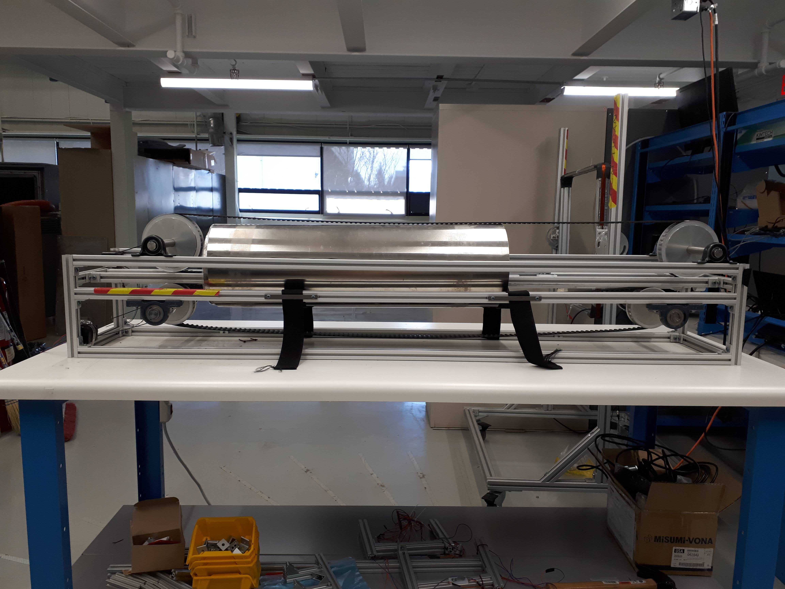
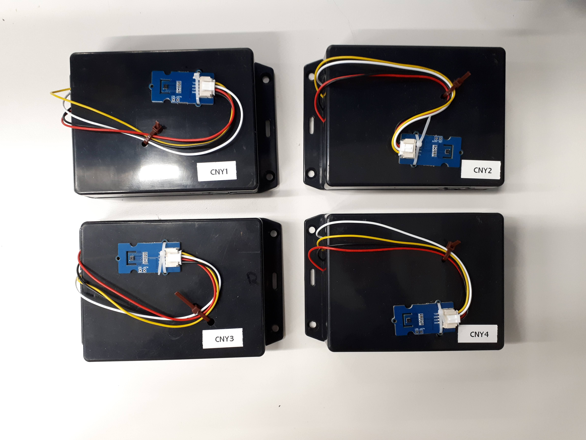

## Top Skills Used

- Motor control
- 3D printing
- Python GUI application development
- Programmable instrument communication
- Electrical circuitry and soldering
- IoT networking

## Project Overview

During my internship at [TRIUMF](https://www.triumf.ca/), Canada’s particle accelerator centre, I worked with the [UltraCold Neutron group](https://www.triumf.ca/node/39465) to develop test equipment for a neutron electric dipole moment experiment.

I improved the design of an automated gradiometer, a device used to measure weak magnetic fields produced by potentially magnetized components. Because the experiment involves detecting extremely weak magnetic fields inside a magnetically shielded room, the smallest interference from internal components could compromise the measurement. To ensure accuracy, every component placed inside the room must be examined with the gradiometer.

The gradiometer consists of a conveyor belt controlled by two stepper motors and is shielded from external magnetic fields with Mu-metal. As a component travels along the conveyor belt, it passes through the Mu-metal shield, where fluxgate sensors measure its magnetic field. I automated the stepper motor calibration and developed a Python script to control programmable instruments, including a multimeter and an oscilloscope, to automate the fluxgate measurements.

In addition to the gradiometer, I built battery-powered temperature sensors with ESP8266 microcontrollers and temperature-measuring modules. I configured the network so the sensors would regularly transmit temperature readings and battery levels to the server for continuous monitoring. These sensors helped us verify the dependancy of fluxgate measurements on temperature before integrating them into the gradiometer.

  

*The gradiometer setup.*

 
 
*Assembled temperature sensors used in the experiment.*
